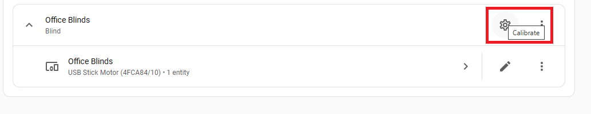

# schellenberg_usb Home Assistant Component

Home Assistant component that interfaces with the [Schellenberg Usb Funk-Stick](https://www.schellenberg.de/smart-home-produkte/smart-home-steuerzentralen/funk-stick/21009/).

> [!WARNING] 
> This integration is not affiliated with Schellenberg, the developers take no responsibility for anything that happens to
> your devices because of this library.

## Features

* Supports blind movement Up, Down, and Stop
* After calibation, position tracking is possible.

## Installation

### Step 1: Download files

#### Option 1: Via HACS

Make sure you have HACS installed. If you don't, run `wget -O - https://get.hacs.xyz | bash -` in HA.  
Choose Integrations under HACS. Click the '+' button on the bottom of the page, search for "schellenberg usb", choose it, and click install in HACS.

#### Option 2: Manual
Clone this repository or download the source code as a zip file and add/merge the `custom_components/` folder with its contents in your configuration directory.

### Step 2: Restart HA
In order for the newly added integration to be loaded, HA needs to be restarted.

### Step 3: Add integration to HA (<--- this is a step that a lot of people forget)
In HA, go to Configuration > Integrations.
In the bottom right corner, click on the big button with a '+'.

If the component is properly installed, you should be able to find 'Schellenberg USB' in the list. You might need to clear you browser cache for the integration to show up.

Select it, and the schellenberg usb integration is ready for use.

### Step 4: Pair your devices

1. In Home Assistant, go to **Settings > Devices & Services**
2. Find the **Schellenberg USB** integration and click on it
3. Click the **+** button or select **Pair device** from the menu
4. Put your blind motor into pairing mode (see [Device Pairing Instructions](#device-pairing-instructions))
5. Once pairing is successful, provide a friendly name for your blind

### Step 5: Calibrate your blinds

Calibration is essential for accurate position tracking. The integration measures how long it takes your blind to fully open and close, allowing it to calculate the current position during operation.

> [!IMPORTANT]
> This calibration is **not** the same as setting the end positions (fully open/closed limits) on your blind motor. End positions must be configured directly on the device itself using the motor's built-in adjustment features or a Schellenberg remote control before using this integration.

#### Starting Calibration

You can calibrate a blind:
- **After pairing from the device page**: Go to the device and click the **Calibrate** gear icon (⚙️) as shown below

*Click the gear icon labeled "Calibrate" in the top right corner of your blind device to start calibration.*

#### Calibration Steps

1. **Step 1 - Close the blind**: Ensure your blind is fully closed (all the way down). Press **Next** when ready.

2. **Step 2 - Measure open time**: 
   - Press **Start** in the dialog
   - Then press the **open button** on your physical remote/control
   - The integration will automatically detect when the blind starts moving and begin timing
   - Wait for the blind to fully open - the timer stops automatically when movement stops

3. **Step 3 - Measure close time**:
   - Press **Start** in the dialog  
   - Then press the **close button** on your physical remote/control
   - The integration will automatically detect when the blind starts moving and begin timing
   - Wait for the blind to fully close - the timer stops automatically when movement stops

4. **Complete**: The integration will display the measured open and close times and save them for position tracking

> [!TIP]
> There's no need to rush when pressing the buttons - the timer doesn't start until the integration receives a "moving" signal from the blind motor.

> [!NOTE]
> If calibration times seem incorrect, you can recalibrate at any time from the device options.

## Device Pairing Instructions

Each Schellenberg device has a specific button combination to enter pairing mode. You must put your device into pairing mode within 2 minutes of starting the pairing process in Home Assistant.

### ROLLODRIVE 65 PREMIUM / 75 PREMIUM (Electric Belt Winders)
**Art.Nr.: 22567, 22576, 22578, 22726, 22727, 22728, 22767**

To enter pairing mode:
1. Press and hold the **Sun (☀)** button and the **Up (▲)** button simultaneously
2. Hold for **5 seconds** until the LED flashes
3. The device is now in pairing mode

### ROLLOPOWER PLUS / STANDARD (Tube Motors)
**Art.Nr.: 20106, 20110, 20406, 20410, 20610, 20615, 20620, 20640, 20710, 20720, 20740**

These motors are controlled via external switches or remote controls. Pairing is typically done through the connected Schellenberg remote control or timer switch.

### Funk-Rollladenmotoren PREMIUM (Radio Tube Motors)
**Art.Nr.: 21106, 21110, 21210, 21220, 21240**

To enter pairing mode, refer to your specific remote control or timer switch manual. The pairing button combination varies by the control device used.

### General Tips

- Keep the USB Funk-Stick within range (approx. 20m indoors, 100m outdoors)
- Avoid metal obstructions between the stick and the motor
- If pairing fails, try moving the USB stick closer to the device
- Consult your device's manual for the exact pairing procedure if the above doesn't work

> [!NOTE]
> The pairing instructions above are based on common Schellenberg products. Your specific device may have different procedures - always refer to the device's original manual if unsure.
