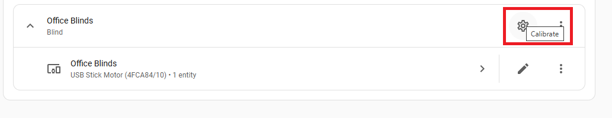

# schellenberg_usb Home Assistant Component

[](https://github.com/GimpArm/schellenberg_usb/releases)
[](https://github.com/GimpArm/schellenberg_usb/blob/main/LICENSE)


Home Assistant component that interfaces with the [Schellenberg Usb Funk-Stick](https://www.schellenberg.de/smart-home-produkte/smart-home-steuerzentralen/funk-stick/21009/).

> [!WARNING] 
> This integration is not affiliated with Schellenberg, the developers take no responsibility for anything that happens to
> your devices because of this library.


## Features

* Supports blind movement Up, Down, and Stop
* Tracks estimated position from measured or manually supplied travel times
* Supports manual command/status identities when calibration cannot create a blind
* Can test a paired command before calibration and edit a blind after creation
* Provides guided USB-transmitter teach-in, raw RF payload testing, and ACK diagnostics

## Installation

### Step 1: Download files

#### Option 1: Via HACS

[](https://my.home-assistant.io/redirect/hacs_repository/?owner=GimpArm&repository=schellenberg_usb&category=integration)

Make sure you have HACS installed. If you don't, run `wget -O - https://get.hacs.xyz | bash -` in HA.  
Choose Integrations under HACS. Click the '+' button on the bottom of the page, search for "schellenberg usb", choose it, and click install in HACS.


#### Option 2: Manual
Clone this repository or download the source code as a zip file and add/merge the `custom_components/` folder with its contents in your configuration directory.

To test a local checkout on Home Assistant OS, use the Samba Share or Studio Code
Server add-on and copy the repository's `custom_components/schellenberg_usb`
directory to `/config/custom_components/schellenberg_usb`. The resulting directory
must contain `manifest.json` directly. Replace the integration files, restart Home
Assistant (a configuration reload is not sufficient), then check **Settings > System
> Logs** for `schellenberg_usb` messages.

Back up an existing copy first. HACS may overwrite these test files during an update,
so restore or reinstall the released version after testing if necessary.


### Step 2: Restart HA
In order for the newly added integration to be loaded, HA needs to be restarted.

### Step 3: Add integration to HA (<--- this is a step that a lot of people forget)
In HA, go to Configuration > Integrations.
In the bottom right corner, click on the big button with a '+'.

If the component is properly installed, you should be able to find 'Schellenberg USB' in the list. You might need to clear you browser cache for the integration to show up.

Select it, and the schellenberg usb integration is ready for use.

### Step 4: Add your devices

1. In Home Assistant, go to **Settings > Devices & Services**
2. Find the **Schellenberg USB** integration and click on it
3. Click the **+** button or select **Add blind** from the menu
4. Choose one of the setup methods:
   - **Pair and test (recommended)** pairs the motor, sends Open for 0.75 seconds
     followed by Stop, and asks whether it moved. A successful test can continue to
     calibration or save with manual travel times. A failed test opens the detected
     values for editing.
   - **Pair and calibrate (legacy)** keeps the original guided setup unchanged.
   - **Add manually** creates a cover from a name, command ID/enum, primary status
     ID/enum, optional additional status identities, and measured open/close travel
     times. Calibration is optional.


The command enum selects the paired slot in the USB stick and is inserted into the
outgoing serial packet. The command device ID is retained for identification and
diagnostic logging. The primary status ID and enum are matched exactly against incoming movement
messages and are the only identity used for position tracking. Additional status
identities can be entered as `DEVICE_ID/ENUM`, one per line or comma-separated.
They are matched for logging and diagnostics, but cannot alter position until their
command family is explicitly mapped. New pairing no longer assumes that the
command/transmit identity is also the receive/status identity. During automatic
calibration, received frames are grouped by device ID and enum and labelled with
the opening, closing, idle, or end-stop phase. A group that emits `00`, `01`, or
`02` is saved as the calibration-derived primary status identity; companion
unknown-command groups are saved as secondary identities. If no recognized stream
is heard, primary status remains explicitly unknown and position is estimated from
Home Assistant commands.

To edit an existing blind, open its configuration action from the Schellenberg USB
integration and choose **Edit identities and travel times**. The same menu also
offers a short motor command test and recalibration. Editing protocol values keeps
the existing Home Assistant entity unique ID.
Choose **Developer tools** in the same blind configuration menu to see separate
snapshots for the newest matched frame, last recognized primary tracking frame,
last secondary frame, and latest position calculation with its source and
estimated/confirmed status. Because the motor provides no absolute position
feedback, the menu also provides **Set position fully open**, **Set position fully
closed**, and **Set position manually** (0–100). These corrections stop the active
estimator, update Home Assistant immediately, and are marked manually confirmed;
later movement is estimated again and may drift until the next correction. The
menu also shows the current transmit target, direct Open, Close, and Stop actions,
a guided **Teach motor / activate USB transmitter** action, **Discover status from
original remote** (OPEN, STOP, CLOSE, STOP during a 45-second capture), validated
raw RF payload sending, and copyable diagnostics. Diagnostics retain the last
calibration end reason, phase-labelled frames, candidate identities, and whether
the saved primary came from calibration, remote discovery, manual entry, or is
still unknown.

Receiving frames from a physical remote proves only that the stick can listen. It
does not mean the motor has authorized the stick as a transmitter. Likewise,
serial responses `t1` and `t0` report that the stick's RF transmitter turned on
and off; this unidirectional protocol cannot confirm that the motor received or
executed the command.


### Diagnostic command service

Before creating or changing a blind, use **Developer Tools > Actions** and run
`schellenberg_usb.test_command`:

```yaml
device_id: F2B8D5
enum: "23"
command: open
```

Valid commands are `open`, `close`, and `stop`. Open and close are direct commands,
so send `stop` yourself when performing a short test. If more than one Schellenberg
USB hub is loaded, also supply its `config_entry_id`. Sending logs the command,
device ID, enum, raw serial payload, write result, and stick ACK cycle. An ACK does
not confirm motor movement.

### Step 5: Calibrate your blinds

Calibration is recommended for accurate position tracking. The integration measures how long it takes your blind to fully open and close, allowing it to calculate the current position during operation. It is optional when the travel times were supplied during manual setup.

> [!IMPORTANT]
> This calibration is **not** the same as setting the end positions (fully open/closed limits) on your blind motor. End positions must be configured directly on the device itself using the motor's built-in adjustment features or a Schellenberg remote control before using this integration.

#### Starting Calibration

You can calibrate a blind:
- **During initial pairing**: After naming your device, you'll be prompted to calibrate
- **After pairing from the device page**: Go to the device and click the **Calibrate** gear icon (⚙️) as shown below



*Click the gear icon labeled "Calibrate" in the top right corner of your blind device to start calibration.*

#### Calibration Steps

1. **Step 1 - Close the blind**: Ensure your blind is fully closed (all the way down). Press **Next** when ready.

2. **Step 2 - Measure open time**: 
   - Press **Start** in the dialog
   - Then press the **open button** on your physical remote/control
   - The integration will automatically detect when the blind starts moving and begin timing
   - Wait for the blind to fully open - the timer stops automatically when movement stops

3. **Step 3 - Measure close time**:
   - Press **Start** in the dialog  
   - Then press the **close button** on your physical remote/control
   - The integration will automatically detect when the blind starts moving and begin timing
   - Wait for the blind to fully close - the timer stops automatically when movement stops

4. **Complete**: The integration will display the measured open and close times and save them for position tracking

> [!TIP]
> There's no need to rush when pressing the buttons - the timer doesn't start until the integration receives a "moving" signal from the blind motor.

> [!NOTE]
> If calibration times seem incorrect, you can recalibrate at any time from the device options.

## Device Pairing Instructions

The USB stick is a separate transmitter and must be learned by the motor. Merely
detecting a frame from an existing remote does not authorize the stick.

### Teach the USB stick to the motor

For the normal **Pair** flow, press Pair in Home Assistant and then complete these
steps within two minutes using an already paired physical remote:

1. Select the motor or channel on the physical remote.
2. Press the remote's programming button until its channel LED blinks.
3. Press **Stop** on the remote and wait for the motor to beep or rattle.
4. Home Assistant detects the frame, sends teach command `60`, waits for the
   stick's `t0`, then sends finish command `40` on the same enum. The Pair and
   Test flow then sends a short Open/Stop test.
5. Confirm movement yourself. The stick ACK cannot report whether the motor learned
   the transmitter.

For an existing manually configured blind, perform steps 1–3 first and then choose
**Developer tools > Teach motor / activate USB transmitter**. Do not repeat command
`60` outside the motor's programming sequence: the protocol also uses it when
changing rotation direction.

The movement packet is exactly 11 characters:
`ss{two-digit enum}9{two-digit command}0000`. Commands are `00` Stop, `01`
Up/Open, `02` Down/Close, `40` Finish/Allow Pairing, and `60` Teach/Change
Direction. For example, enum `10` Open is
`ss109010000`. Developer Tools rejects shorter or non-hexadecimal raw packets.
These details follow the
[reverse-engineered Schellenberg USB protocol](https://github.com/Hypfer/schellenberg-qivicon-usb).

Each Schellenberg product may use a different button combination to enter or expose
programming mode. Its original manual takes precedence over the examples below.

### ROLLODRIVE 65 PREMIUM / 75 PREMIUM (Electric Belt Winders)
**Art.Nr.: 22567, 22576, 22578, 22726, 22727, 22728, 22767**

To enter pairing mode:
1. Press and hold the **Sun (☀)** button and the **Up (▲)** button simultaneously
2. Hold for **5 seconds** until the LED flashes
3. The device is now in pairing mode

### ROLLOPOWER PLUS / STANDARD (Tube Motors)
**Art.Nr.: 20106, 20110, 20406, 20410, 20610, 20615, 20620, 20640, 20710, 20720, 20740**

These motors are controlled via external switches or remote controls. Pairing is typically done through the connected Schellenberg remote control or timer switch.

### Funk-Rollladenmotoren PREMIUM (Radio Tube Motors)
**Art.Nr.: 21106, 21110, 21210, 21220, 21240**

To enter pairing mode, refer to your specific remote control or timer switch manual. The pairing button combination varies by the control device used.

### General Tips

- Keep the USB Funk-Stick within range (approx. 20m indoors, 100m outdoors)
- Avoid metal obstructions between the stick and the motor
- If pairing fails, try moving the USB stick closer to the device
- Consult your device's manual for the exact pairing procedure if the above doesn't work

> [!NOTE]
> The pairing instructions above are based on common Schellenberg products. Your specific device may have different procedures - always refer to the device's original manual if unsure.
